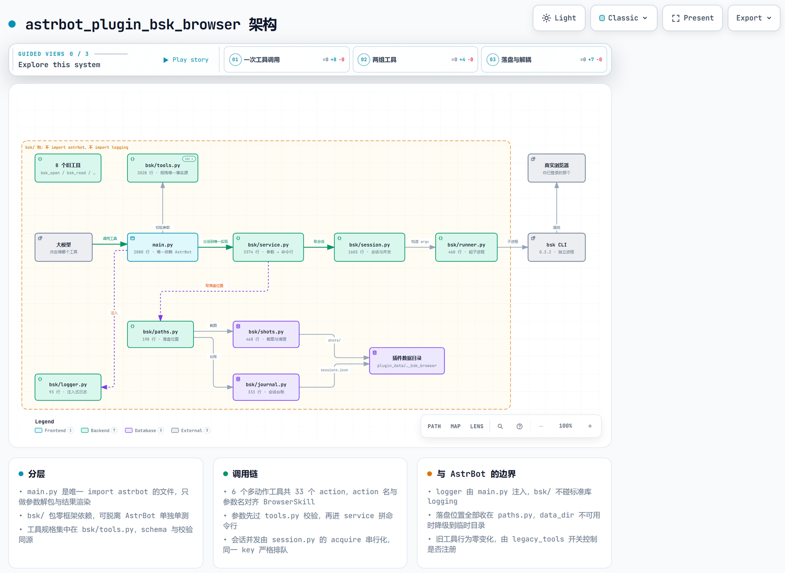

# astrbot_plugin_bsk_browser

让 AstrBot 机器人操作你**已经登录好的真实浏览器**：打开网页、读取内容、点击按钮、填写表单、截图。

> 本插件是腾讯 [BrowserSkill](https://github.com/Tencent/BrowserSkill)（命令名 `bsk`）的**第三方非官方集成**。
> 详见文末[合规声明](#11-合规声明)。



上图是一次工具调用的完整链路，以及插件与 AstrBot 的边界。
想放大看细节 / 搜索节点 / 按关系追踪，用浏览器打开可交互版本：
[`docs/architecture.html`](docs/architecture.html)（源文件 `docs/architecture.json`，可用 archify 重新渲染）。

---

## 1. 这是什么

一句话：它把 `bsk` 这个命令行工具包成机器人能直接调用的工具，而 `bsk` 能指挥你桌面上那个已经登录好的浏览器。

平时你能直接看网盘、邮箱、后台系统，是因为浏览器里存着你的登录状态（Cookie、已登录的账号）。本插件让机器人借用同一个浏览器干活 —— 所以那些需要登录才能看的页面，它也能直接读。

整条链路是一条单向调用链：

```
 你（在 QQ / Telegram 里对机器人说话）
      │  「用浏览器打开 example.com 看看写了什么」
      ▼
┌─────────────┐
│   AstrBot   │  收到消息 → 交给大模型 → 模型决定调用哪个工具
└──────┬──────┘
       │  调用本插件注册的工具（bsk_session / bsk_page / bsk_inspect / …）
       ▼
┌─────────────┐
│   本插件     │  把工具参数翻译成一条 bsk 命令行
└──────┬──────┘
       │  启动子进程执行命令
       ▼
┌─────────────┐
│  bsk 命令行  │  腾讯 BrowserSkill 提供，需要你自己另外安装
└──────┬──────┘
       │  本地通信
       ▼
┌─────────────┐
│  浏览器扩展  │  装在 Chrome / Edge 里，需要你自己另外安装
└──────┬──────┘
       ▼
┌─────────────┐
│ 你已登录的   │  插件会让它开一个专用窗口（Agent Window）来干活
│   浏览器     │
└─────────────┘
```

**先记住三个事实**：

- 本插件**不包含** `bsk`，也不包含浏览器扩展。这两样都要你自己装（见第 3 节）。
- 「Agent Window」是 `bsk` 在你浏览器里开出的专用窗口，机器人就在这个窗口里操作网页。
- 它是一个浏览器会话（session）：会话存续期间网页状态（当前页、填了什么）会保留，直到你让它关掉、或它空闲太久被回收。

---

## 2. 和别的浏览器插件有什么不同

**核心区别只有一条：复用你已登录的账号。**

AstrBot 生态里已有的浏览器类插件，绝大多数是「另开一个干净的无头浏览器」—— 程序在后台启动一个全新的、空的浏览器去访问网页。问题在于：

| 场景 | 「干净的无头浏览器」 | 本插件 |
|---|---|---|
| 打开公开网页（新闻、文档） | ✅ 可以 | ✅ 可以 |
| 打开你的网盘 / 邮箱 / 后台系统 | ❌ 没有登录状态，只会跳到登录页 | ✅ 直接就是你登录好的状态 |
| 需要短信验证码的站点 | ❌ 机器人拿不到验证码 | ✅ 你自己在浏览器里登录一次就行 |
| 页面操作影响真实账号 | ❌ 影响的是那个临时浏览器 | ⚠️ 影响你自己真实的账号（这是能力，也是风险） |

代价很直接：**它不是安全沙箱**。机器人操作的就是你日常在用的那个浏览器、那些账号。所以本插件默认只允许 AstrBot 管理员使用（见第 5、10 节）。

---

## 3. 安装前置条件

需要三样东西，缺一不可。插件不会替你装其中任何一样。

### 3.1 安装 `bsk` 命令行工具

`bsk` 是腾讯 BrowserSkill 项目提供的命令行工具，本项目只是调用它。

**Windows（PowerShell）**：

```powershell
irm https://raw.githubusercontent.com/Tencent/BrowserSkill/main/install.ps1 | iex
```

默认装到 `C:\Users\<你的用户名>\.local\bin\bsk.exe`
（例如 `C:\Users\Alice\.local\bin\bsk.exe`）。

**macOS / Linux**：参考 [BrowserSkill 官方仓库](https://github.com/Tencent/BrowserSkill)，一般落在 `~/.local/bin/bsk`。

怎么确认装好了 —— 新开一个终端窗口执行：

```powershell
bsk --version
```

能打印版本号就说明装好了。如果提示「不是内部或外部命令 / command not found」，说明没装成功，或者装完没有重开终端（PATH 需要新开窗口才生效）。

### 3.2 安装浏览器扩展

在 Chrome 或 Edge（需要 Chromium 125 或更新版本）里安装 BrowserSkill 配套的浏览器扩展，安装方法同样见[官方仓库](https://github.com/Tencent/BrowserSkill)。

装完后必须确认一件事：扩展图标显示「已连接」。

- 显示未连接时：确认浏览器是开着的、扩展是启用状态，然后点一下扩展图标看它的提示。
- 这一步没做好，后面所有工具都会报「没有已连接的浏览器」之类的错误。

### 3.3 让 AstrBot 能找到 `bsk`

两种方式，推荐第二种：

1. 让系统 PATH 能找到 `bsk`（配置里 `bsk_path` 填 `bsk`，这是默认值）。
   缺点：AstrBot 若以开机自启方式运行，可能没继承到装 `bsk` 之后的新 PATH。
2. 在插件配置里直接填绝对路径（最稳妥），例如 `C:\Users\Alice\.local\bin\bsk.exe`。

### 3.4 自检

三步做完后，在终端执行 `bsk doctor`，它会检查环境并告诉你还缺什么。
另外 `bsk browsers --json` 可以看到当前有哪些浏览器连上了。

---

## 4. 安装本插件

**第 1 步**：把整个 `astrbot_plugin_bsk_browser` 文件夹（注意：是文件夹本身，不是里面的文件）放到 AstrBot 的插件目录：

| 系统 | 插件目录 |
|---|---|
| Windows | `C:\Users\<你的用户名>\.astrbot\data\plugins\` |
| Linux / macOS | `~/.astrbot/data/plugins/` |

放好后路径应该长这样：`C:\Users\Alice\.astrbot\data\plugins\astrbot_plugin_bsk_browser\main.py`

> 目录名必须是 `astrbot_plugin_bsk_browser`，`main.py` 必须直接位于该目录里。
> 如果多套了一层文件夹（变成 `...\astrbot_plugin_bsk_browser\astrbot_plugin_bsk_browser\main.py`），插件会加载失败。

**第 2 步**：打开 AstrBot WebUI → 插件管理 → 重载插件（Reload）。

**第 3 步**：确认插件出现在列表里且状态为已启用。没出现就去 AstrBot 日志里看有没有报错。

**第 4 步**：在插件配置页填写 `bsk_path`（见 3.3），保存后重载插件。

---

## 5. 配置项说明

在 AstrBot WebUI 的插件配置页可以修改以下 19 项。默认值以下表为准（与 `_conf_schema.json`、`bsk/config.py` 完全一致）。

| 配置项 | 类型 | 默认值 | 说明 |
|---|---|---|---|
| `enabled` | 布尔 | `true` | 插件总开关。关掉后所有浏览器工具直接拒绝调用，但不用卸载插件。 |
| `legacy_tools` | 布尔 | `true` | 是否注册旧版工具。默认开启：开启时注册 4 个常用旧工具（`bsk_screenshot` / `bsk_close` / `bsk_status` / `bsk_logs`，见 6.2），罕见的 3 个由下面的 `legacy_fringe_tools` 单独控制。关掉它会停用全部 8 个旧工具，每轮对话省下 1631–1803 字符的工具说明（实测，见 6.3）。**`bsk_evaluate` 不受这一项影响**（它有独立的 `enable_evaluate`）。 |
| `legacy_fringe_tools` | 布尔 | `false` | 是否注册罕见的 3 个旧工具：`bsk_open`（打开网页）、`bsk_read`（读页面）、`bsk_act`（点击/输入等交互）。默认关闭 —— 这三个都有等价的新工具（`bsk_page` / `bsk_inspect` / `bsk_interact`），关掉不会少任何能力，只省下每轮 1941–2061 字符（实测）。提示词或工作流里还在直接写这三个名字时才需要打开。只在 `legacy_tools` 开启时才有意义。 |
| `lazy_debug_tool` | 布尔 | `true` | `bsk_debug`（抓包与网络调试，24 个动作）是否按需加载。默认开启：它一开始不注册给模型，模型需要调试时先调常驻的小工具 `bsk_load_tools` 把它加载进当轮（只在当轮有效）。关掉它就变成一直注册、随时可用，代价是每轮多带 4937–4971 字符（实测约 5000）。详见 6.1。 |
| `bsk_path` | 字符串 | `"bsk"` | `bsk` 可执行文件的位置。填 `bsk` 表示从系统 PATH 查找；找不到时改填绝对路径，如 `C:\Users\Alice\.local\bin\bsk.exe`。 |
| `browser_instance_id` | 字符串 | `""`（空） | 指定用哪个浏览器。留空即可：插件会自动选用唯一一个已连接的浏览器；同时连了好几个时才会报错要求你指定。 |
| `command_timeout_sec` | 浮点 | `60.0` | 所有浏览器命令的统一超时（你愿意等多久）。每条命令另有一个内置的「最少需要多久」（打开网页 45 秒、读取页面 15 秒等），插件取两者里较大的那个 —— 所以调大这一项一定生效，调小它也不会让慢命令提前失败。最多填 110。整页截图通常不需要动这一项（实测约 11 秒），详见第 9 节第 1 条。 |
| `max_sessions` | 整数 | `3` | 最多同时开几个浏览器会话。每个会话占一个 Agent Window（一个浏览器窗口），别开太多。超了会关掉最久没人用的那个。 |
| `admin_only` | 布尔 | `true` | **只允许 AstrBot 管理员使用。强烈建议保持开启**，详见下方说明。 |
| `allowed_users` | 列表 | `[]`（空） | 额外放行的用户 ID 白名单。填了之后，名单里的人即使不是管理员也能用。可以一行一个，也可以写 `123,456`。 |
| `session_scope` | 字符串 | `"umo"` | 会话隔离方式。`umo` = 按聊天窗口隔离（同一个群里的人共用一条浏览器会话，不同群各一条）；`user` = 在上面基础上再按人拆开，每个群的每个人各一条（同一个人在 A 群和 B 群是两条独立会话，互不干扰）。 |
| `idle_release_sec` | 浮点 | `240.0` | 空闲多久主动关掉浏览器会话（秒）。必须小于 300，因为 `bsk` 自己会在空闲 5 分钟（300 秒）时回收会话。 |
| `fullpage_timeout_sec` | 浮点 | `120.0` | 整页截图（`bsk_screenshot` 的 `full_page`）最多等多久，范围 30–600 秒。它只管浏览器操作这一段耗时，与模型生成回复的快慢无关（模型出字慢不是调大这一项能解决的）。实测长页面约 11.7 秒、短页面约 2.9 秒，所以默认 120 秒已有约 10 倍余量，通常不用改。它不影响视口截图（固定 30 秒）。⚠️ 注意 AstrBot 自己也有一层上限，见第 9 节第 1 条。 |
| `screenshot_dir` | 字符串 | `""`（空） | 截图保存目录。留空即可，会存到插件数据目录下的 `astrbot_plugin_bsk_browser\shots`（即 `data\plugin_data\astrbot_plugin_bsk_browser\shots`）。要自己指定就得填完整路径；目录不存在会自动创建（父级目录也会一起建）。 |
| `journal_path` | 字符串 | `""`（空） | 会话所有权记录文件的位置。留空即可，会写到插件数据目录下的 `astrbot_plugin_bsk_browser\sessions.json`（即 `data\plugin_data\astrbot_plugin_bsk_browser\sessions.json`）。这份记录记的是「插件自己开过哪些浏览器会话」：万一 AstrBot 被强制结束（任务管理器结束进程、崩溃、断电）来不及关窗口，下次启动时插件靠它把自己遗留的那些会话精确关掉（只认 id 和窗口号，不会碰别的程序开的会话）。只有想固定这个文件的位置、方便自己打开查看时才填完整路径。 |
| `max_page_chars` | 整数 | `3000` | 单次读网页时最多把多少个字符交给模型。网页正文动辄几万字，全塞进去会占满上下文、变慢变贵。最大 20000。执行 JavaScript 的返回值也按这个上限截断。 |
| `enable_evaluate` | 布尔 | `false` | **允许执行 JavaScript（高风险，默认关闭）。强烈建议保持关闭**，详见下方说明。打开后模型才能真的用上 `bsk_evaluate` 工具。 |
| `evaluate_require_admin` | 布尔 | `true` | 执行 JavaScript 仅限管理员。建议保持开启。开启时，即使关掉了 `admin_only` 或把某人加进白名单，**非管理员依然不能执行脚本**。 |
| `enable_request_id` | 布尔 | `true` | 可恢复启动：建立会话时额外用一次性令牌把这次启动「预约」下来，这样即使启动超时或回执丢失，插件仍能凭令牌找回并关掉那个已经开出来的窗口，不在桌面上留下孤儿窗口。代价是每次建会话多两条命令、实测约多花 80 毫秒（只在新会话建立时产生一次）。默认开启，**平时不要关** —— 它只作为排查手段：怀疑「启动异常/窗口关不掉」与可恢复启动本身有关时，可以关掉它来排除这一项。详见 6.6。 |

### ⚠️ 关于 `admin_only`（默认开启）

**这是本插件最重要的一项配置。**

- 默认开启（`true`）：只有 AstrBot 管理员能调用这些工具。
- 一旦关闭（`false`）：**任何能给机器人发消息的人**都能操控你这台电脑上已登录的浏览器 —— 翻你的网页、点按钮、填表单、截图，包括网银、邮箱、公司内部系统。插件启动时也会在日志里打印一条警告。

只想给某个人用怎么办？ 不要关 `admin_only`，而是保持它开启，把对方的用户 ID 填进 `allowed_users`。对方被拒绝时提示里会带上自己的 ID，也可以去 AstrBot 日志里找 `sender_id`。白名单的优先级高于管理员检查 —— 被写进白名单的人即使不是管理员也能使用。

### ⚠️⚠️ 关于 `enable_evaluate`（默认关闭，请先读完再决定）

**这是本插件风险最高的功能，默认关闭。** 打开后，机器人可以在你已登录的页面里运行任意 JavaScript。

它和"点击、输入"不是同一个量级的东西：

| | `bsk_act`（点击/输入/滚动） | `enable_evaluate` 打开后 |
|---|---|---|
| 你能看见吗 | 能。动作会显示在浏览器窗口里，你可以随时接管 | 看不见。脚本在后台静默运行 |
| 能读到什么 | 页面上显示出来的内容 | 页面上一切：邮箱正文、后台数据、隐藏字段、登录凭证（token） |
| 能发请求吗 | 只能通过点按钮间接触发 | 可以直接带着你的登录状态发请求、提交表单 |
| 页面的确认框 | 会正常弹出、拦住操作 | 被自动点「确定」（实测确认，你根本看不到那个弹窗） |

换句话说：`bsk_act` 的能力边界是"你能看见的操作"，而执行脚本没有这条边界。

**保持关闭有什么影响**：没有影响。读网页、点按钮、填表单、截图全都不需要它。

确实需要时怎么开（两步，缺一不可）：

1. 打开 `enable_evaluate`；
2. 确认 `evaluate_require_admin` 保持开启（默认就是开启的）。

第 2 项是故意设计成"要单独关一次"的：即使你把 `admin_only` 关掉了、或者把某人加进了 `allowed_users` 白名单，只要这一项是开启的，非管理员就依然不能执行脚本。因为 `admin_only=false` 表达的是"我愿意把看得见的操作开放给其他人"，而执行脚本是静默的 —— 不该让一个宽松的总开关顺手把最高危的能力一起放开。要真正放开，需要你明确做两次决定。

> **提示**：开启后插件启动时会在日志里打印一条针对性的安全提醒。如果你在日志里看到它，说明这个能力当前是打开的。

### 怎么查 `browser_instance_id`

只有在你同时连了多个浏览器、需要指定其中一个时才要填。步骤：

1. 打开终端执行 `bsk browsers --json`；
2. 在输出里找到 `instance_id` 字段，它形如 `c900a3da`（一串短十六进制字符）；
3. 把这个值填进配置。

> **注意**：输出里的 `label` 字段经常是空的，不能用它来指定浏览器，请认准 `instance_id`。插件内部也只认 `instance_id`。

---

## 6. 8 个主工具 + 两组 legacy 旧工具

插件一共注册 **16 个工具**，但默认只有 **12 个**会进入模型的工具列表：

- **8 个主工具（推荐）** —— 多数与腾讯 BrowserSkill 的命令结构一一对应（`bsk_debug` 是从 `browser_inspect` 拆出来的调试部分，`bsk_load_tools` 是本插件独有的加载入口，见 6.5），一个工具管一类事，用 `action` 参数选择具体动作，合计 **57 个 action**。其中 `bsk_debug` 默认按需加载（模型要先调 `bsk_load_tools`），所以默认就在列表里的是 7 个；
- **4 个常驻旧工具（core）** —— `bsk_screenshot` / `bsk_close` / `bsk_status` / `bsk_logs`，由 `legacy_tools`（默认开启）控制。这几个要么新工具做不到（发图片、整页截图），要么是诊断入口；
- **3 个罕见旧工具（fringe）** —— `bsk_open` / `bsk_read` / `bsk_act`，都有等价的新工具，由 `legacy_fringe_tools`（默认关闭）控制。

另外 `bsk_evaluate` 是独立的高危工具，始终在注册表里，能不能用只由 `enable_evaluate` 决定（见第 5 节）。7 + 4 + 1 = 12，这就是默认的注册数。

你不需要记这些名字 —— 直接对机器人说人话就行，模型会自己决定调哪个。下表供你排查问题时对照。

### 6.1 八个主工具（推荐）

| 工具名 | 做什么 | `action` 取值 | 模型通常在什么时候调用 |
|---|---|---|---|
| `bsk_session` | 管理浏览器会话：启动、停止、列出。 | `start`、`stop`、`list`（3 个） | 要用浏览器前先 `start`；用户说「关掉浏览器」时 `stop`；排查「我这边还有会话吗」时 `list`。 |
| `bsk_page` | 页面导航与等待。 | `navigate`、`back`、`forward`、`reload`、`wait`（5 个） | 用户说「打开 xxx」「回到上一页」时；点了会跳转的链接之后用 `wait` 等加载完成，避免读到旧页面。 |
| `bsk_inspect` | 读取页面状态；抓控制台消息与网络请求。 | `observe`、`snapshot`、`html`、`screenshot`、`console`、`network`（6 个） | 最常用的是 `observe`（读正文 + 元素编号）；用户说「截个图」时用 `screenshot`；页面看起来没反应时用 `console` / `network` 查背后发生了什么。 |
| `bsk_debug` ⚠️ | 抓包与网络调试：看性能与请求、导出证据，以及显式控制网络流量。**默认按需加载**。 | `performance`、`aggregate`、`duplicates`、`capabilities`、`activity`、`wait`、`pin`、`unpin`、`start`、`stop`、`status`、`requests`、`request`、`operations`、`operation`、`console`、`pages`、`export`、`rules`、`rule_add`、`rule_enable`、`rule_disable`、`rule_remove`、`replay`（24 个） | 模型要先调 `bsk_load_tools` 把它加载进来，再用它查接口返回、慢请求、重复请求，或拦截/改写/重放请求。⚠️ `replay` 会带着你的登录状态把一条真实请求重发一次（可能改动服务端数据）；`rule_add` / `rule_enable` 能拦截、改写或伪造真实请求的返回。 |
| `bsk_load_tools` | 按需加载大工具，目前只有 `debug` 一组。 | `debug`（1 个） | 模型需要抓包或网络调试时，先调它把 `bsk_debug` 加载进**当前这一轮**。 |
| `bsk_interact` | 与页面交互：点击、输入、按键、滚动等。 | `click`、`hover`、`wheel`、`scroll-to`、`focus`、`blur`、`fill`、`select`、`press`（9 个） | 用户说「点那个按钮」「在搜索框里输入 xxx」「往下滚一点」时。操作完通常再 `observe` 一次确认结果。 |
| `bsk_tabs` | 管理当前会话可见的标签页。 | `list`、`create`、`select`、`close`、`borrow`、`return`（6 个） | 需要同时开好几页、或在多个标签页之间来回切换时。⚠️ `borrow` 会把**你自己**的标签页移进 Agent Window，用完请尽快 `return`（停止会话时会自动归还）。 |
| `bsk_assist` | 调整窗口尺寸、模拟手机/平板设备、请真人帮忙完成页内步骤。 | `resize`、`emulate`、`request-help`（3 个） | 要测响应式布局时用 `resize` / `emulate`；遇到验证码、短信码这类机器人做不了的事，用 `request-help` 弹出提示浮层等你操作。 |

几点需要知道的行为：

- **`bsk_debug` 默认按需加载**：它一开始不在模型的工具列表里，模型需要时会先调 `bsk_load_tools(action="debug")`，之后**同一轮对话的下一步**就能用 `bsk_debug` 了。加载只对当前这一轮有效 —— 你发下一条消息时它又回到未加载状态。这样做是因为它光参数说明就有 4431 字符，而绝大多数对话并不调试网络。想让它一直在，把 `lazy_debug_tool` 关掉即可（代价是每轮多带约 5000 字符）。
- `bsk_inspect` 的 `screenshot` **只回一段文字描述，不会把图片发给你**。要真的收到图片、或要整页长图，请让机器人用旧工具 `bsk_screenshot`（见 6.2）。
- `bsk_session(start)` 的 `no_focus` 参数目前没有效果：本插件始终在后台打开窗口，不抢焦点。保留这个参数只是为了让参数名与 BrowserSkill 对齐。
- `bsk_assist` 的 `request-help` 返回的 `outcome` 里，**只有 `continued` 与 `completed` 表示你已经做完了**；`cancelled` / `timed_out` / `navigated` / `disabled` 都不是。这一点插件会如实转达给模型，避免它在你根本没碰过的页面上继续操作。

### 6.2 两组 legacy 旧工具

0.1.x 时代的单动作工具一共 8 个，行为一个字没改，只是描述里加了一句「兼容保留，新用法请优先用 XX」。它们现在分两组：

| 分组 | 工具名 | 由哪一项配置控制 | 默认 |
|---|---|---|---|
| core（常用、无等价替代） | `bsk_screenshot`、`bsk_close`、`bsk_status`、`bsk_logs` | `legacy_tools` | 注册 |
| fringe（都有等价新工具） | `bsk_open`、`bsk_read`、`bsk_act` | `legacy_tools` + `legacy_fringe_tools` | **不注册** |

要找回 fringe 那三个，把 `legacy_fringe_tools` 打开；要一次停用全部 8 个，把 `legacy_tools` 关掉（此时 `legacy_fringe_tools` 填什么都不影响结果）。`bsk_evaluate` 两组都不属于，它只由 `enable_evaluate` 控制。

| 工具名 | 做什么 | 模型通常在什么时候调用 |
|---|---|---|
| `bsk_open`（默认不注册） | 打开一个网址，并顺带把页面内容读回来（标题 + 正文摘要 + 可交互元素编号）。已有会话就复用，没有就新建。参数：`url`（必填，必须 `http://` 或 `https://` 开头）、`new_session`（可选，`true` 表示先关掉当前会话重开一个）。 | 用户说「打开 xxx」「去 xxx 看看」时；页面卡死或需要重新登录时用 `new_session=true` 重开。新工具 `bsk_page` + `bsk_inspect` 已经覆盖它。 |
| `bsk_read`（默认不注册） | 读取当前页面的内容和可交互元素编号。返回页面标题、正文摘要，以及形如 `@e1`、`@e2` 的元素编号。 | 用户说「这个页面写了什么」时；或刚做完一次点击/输入、需要确认页面变化时。页面变化后编号会变，所以操作完建议重新读一次。新工具 `bsk_inspect` 已经覆盖它。 |
| `bsk_act`（默认不注册） | 在当前页面上执行一个操作（点击、输入、按键、滚动等），动作列表见 6.4。 | 用户说「点那个按钮」「在搜索框里输入 xxx」「往下滚一点」时。操作完通常会再调 `bsk_read` 确认结果。新工具 `bsk_interact` 已经覆盖它。 |
| `bsk_screenshot` | 给当前页面截图，并直接把图片发给你。参数：`full_page`（可选，`true` 截取整个长页面，较慢；默认只截可见区域）。 | 用户说「截个图看看」时。**目前只有它能真的把图片发出去、也只有它能整页截图**，新工具做不到这两件事。 |
| `bsk_close` | 关闭当前聊天正在使用的浏览器会话（会关掉那个 Agent Window）。 | 用户说「关掉浏览器」「不用了」「结束」时。长时间不用的会话也会自动回收，但显式关闭更干净。 |
| `bsk_status` | 检查环境：`bsk` 是否装好、浏览器扩展是否连上、当前有多少会话。这个工具不需要管理员权限，方便任何人自助排查。 | 用户说「为什么用不了」「检查一下」时；或任何浏览器操作失败后。 |
| `bsk_logs` | 读控制台消息或网络请求，支持 `since` 游标增量读取。 | 与 `bsk_inspect` 的 `console` / `network` 等价，保留是为了兼容旧提示词的写法。 |
| `bsk_evaluate` ⚠️ | 在页面里执行任意 JavaScript 并返回结果，参数：`expression`（要执行的 JS 表达式，如 `document.title`）。默认关闭，且默认仅管理员可用，见第 5 节的说明。返回值过长会被截断（上限同 `max_page_chars`）。 | 关闭时（默认）这个工具虽然也出现在模型的工具列表里，但**每次调用都会被拒绝**并返回一句中文说明，实际执行不了任何脚本。打开 `enable_evaluate` 后才真正可用。 |

### 6.3 关于两个旧工具开关：要不要关掉旧工具

**`legacy_tools` 默认开启（`true`）** —— 这是刻意的默认值。AstrBot 的插件配置是「缺什么补什么、已有的不动」的合并语义，所以升级时旧配置里没有这一项，会自动补上默认值 `true`；如果默认成 `false`，等于在你毫不知情的情况下**静默关掉** 8 个旧工具（`bsk_evaluate` 不受影响）。

**`legacy_fringe_tools` 默认关闭（`false`）** —— 这是本次升级里唯一会让老用户感知到的默认变化：`bsk_open` / `bsk_read` / `bsk_act` 这三个旧名字不再注册（它们都有等价的新工具，见 6.2）。提示词或工作流里还在直接写这三个名字的话，把这一项打开即可找回。

**各自能省多少**：模型每轮对话都要带上全部工具的说明和参数定义，少注册一个就少付一份。实测数据（本机 AstrBot 4.28.1，取框架真正序列化给 provider 的那份工具说明，按三种 provider 格式分别计算）：

| 配置 | 注册的工具 | Google | Anthropic | OpenAI |
|---|---|---|---|---|
| 全部打开（`legacy_tools=true` + `legacy_fringe_tools=true` + `lazy_debug_tool=false`） | 16 个 | 20178 | 20365 | 20749 |
| `legacy_tools=true` + `legacy_fringe_tools=true` | 15 个 | 15241 | 15426 | 15778 |
| **默认**（`legacy_tools=true`、fringe 关、调试按需加载） | **12 个** | **13300** | **13413** | **13717** |
| `lazy_debug_tool=false`（`bsk_debug` 一直注册） | 13 个 | 18237 | 18352 | 18688 |
| `legacy_tools=false`（8 个旧工具全停） | 8 个 | 11669 | 11674 | 11914 |

从这张表能直接读出的几件事：

- **默认配置比本次升级前省得多**：升级前是 6 个主工具 + 8 个旧工具（`bsk_inspect` 还带着 24 个调试参数），默认注册 14 个工具、18914 / 19097 / 19417 字符；现在默认 12 个、13300 / 13413 / 13717 字符 —— **每轮少 5614 / 5684 / 5700 字符（约 29%）**。
- **关掉 `legacy_tools`**（8 个旧工具全停）：相对默认再省 1631 / 1739 / 1803 字符。看着不多，是因为默认状态下 fringe 那三个本来就没注册 —— 「8 个旧工具全开」与「全关」之间的差额是 3572 / 3752 / 3864 字符（配置页 hint 里写的「约 3600 字符」就是这个口径）。
- **打开 `legacy_fringe_tools`**（找回 `bsk_open` / `bsk_read` / `bsk_act`）：多付 1941 / 2013 / 2061 字符（hint 里写的「约 1900」）。
- **关掉 `lazy_debug_tool`**（让 `bsk_debug` 一直注册）：多付 4937 / 4939 / 4971 字符（hint 里写的「约 5000」）。

> 口径说明：把这些工具按 AstrBot 的 `ToolSet` 序列化成 provider 实际收到的那份 JSON，取 `len(json.dumps(..., ensure_ascii=False))`。三种 provider 格式的包装不同，所以同一份工具在三种格式下字符数略有差异；这里算的只是工具块里属于本插件的那一段，不含其它插件的工具。

还有两个已知限制，改之前请先看一眼：

1. 这两个开关都**只在插件重新加载时生效**，改完配置要去插件管理里重载一次；
2. 如果你以前在 AstrBot WebUI 的「扩展 → 组件」里手动关过某个工具，那个关闭状态会**优先**于这两项。

### 6.4 `bsk_act` 支持的动作

`action` 参数请取下列值（建议统一用下划线；写成横线（如 `scroll-to`）插件会先自动转成下划线再处理，两种写法都能用，但统一用下划线更不容易出错）：

| 动作 | 作用 | 必填参数 |
|---|---|---|
| `click` | 点击元素 | `target` |
| `fill` | 在输入框里填文字 | `target`；`value` 是要填进去的文字，插件不强制校验，留空就等于把输入框清空 |
| `press` | 按键 | `key_spec`（如 `Enter`、`Escape`、`Tab`、`Ctrl+A`、`ArrowDown`）；`target` 可选，填了表示先聚焦该元素再按键 |
| `select` | 下拉框选择 | `target`、`value` |
| `hover` | 鼠标悬停在元素上 | `target` |
| `scroll_to` | 滚动到某个元素 | `target` |
| `wheel` | 滚动页面 | `delta_y`（正数向下、负数向上，单位像素）；`delta_x` 同理控制左右 |
| `focus` | 让元素获得焦点 | `target` |
| `blur` | 让元素失去焦点 | `target` |
| `reload` | 刷新当前页面 | — |
| `navigate_back` | 后退 | — |
| `navigate_forward` | 前进 | — |
| `wait_for_navigation` | 等页面加载完成（点了会跳转的链接、提交表单之后用它，避免读到旧页面） | — |

`target` 可以填两种东西：元素编号（`@e3`，来自 `bsk_read` 的输出），或 CSS 选择器（如 `#search`、`.submit-btn`，懂前端的话可以用）。

### 6.5 与 BrowserSkill 的对应关系

八个主工具里有六个是直接照搬腾讯 BrowserSkill 的命令结构（另外两个见下表末两行），**工具名换成 `bsk_` 前缀，但 action 名与参数名完全一致**：

| 本插件 | BrowserSkill | 说明 |
|---|---|---|
| `bsk_session` | `browser_session` | 会话的启动、停止、列出 |
| `bsk_page` | `browser_page` | 导航、前进后退、刷新、等待 |
| `bsk_inspect` | `browser_inspect` | 读页面、截图、控制台、网络 |
| `bsk_debug` | `browser_inspect` 的 debug 部分 | 从上面那个工具里拆出来的抓包与网络调试，24 个 action 名与 BrowserSkill 的 debug 子动作一致。拆开是为了让不调试的对话不必为它付费（见 6.1） |
| `bsk_load_tools` | （无对应） | 本插件独有的按需加载入口。BrowserSkill / DSH 侧的懒加载由 skill 触发，没有一个同名工具 |
| `bsk_interact` | `browser_interact` | 点击、输入、按键、滚动等页面交互 |
| `bsk_tabs` | `browser_tabs` | 标签页的列出、新建、切换、关闭、借用、归还 |
| `bsk_assist` | `browser_assist` | 窗口尺寸、设备模拟、请真人帮忙 |

「action 名与参数名一致」不是巧合，是这次改造的目标：你按 BrowserSkill 文档写的提示词，把工具名换个前缀就能直接用。参数同时接受 `snake_case` 与 `camelCase`（BrowserSkill 文档里是后者），插件会自动归一化。

**本插件超出 BrowserSkill 的部分**（BrowserSkill 本身不提供，请继续用旧工具）：执行任意 JavaScript 的 `bsk_evaluate`，以及 `bsk_screenshot` 的整页截图能力。

> 本插件与腾讯没有任何隶属关系，工具命名沿用 `bsk_` 前缀是为了与 0.1.x 保持连续、并避免与生态里其它 `browser_*` 插件撞名，不代表官方。详见第 11 节。

### 6.6 可恢复启动：启动超时不再留下关不掉的窗口

这是 0.3.0 修掉的一个真实缺陷，和日常使用直接相关，值得单独说清楚。

**此前的表现**：如果 `bsk session start` 恰好超时（或回执在中途丢失），浏览器窗口**可能已经开出来了**，但插件拿不到它的会话 id，桌面上于是留下一个既关不掉、也清理不掉的窗口 —— 重启 AstrBot 也带不走它，因为插件的会话记录里根本没有这一条。旧代码的顺序是「先等 start 返回，成功后再写记录」，而超时会让 `start` 直接抛异常，写记录那一步**永远不会执行**。

**现在的做法**（`enable_request_id`，默认开启）：把「先落盘、再启动」倒过来 ——

1. 先给这次启动生成一个一次性令牌，**在发命令之前**写进会话记录文件；
2. 用这个令牌向 `bsk` 预约这次启动（这一步只记账、不开窗口）；
3. 带令牌执行 `session start`；
4. 成功后认领这个令牌，把它标成「属于我」。

之后无论第 3 步发生什么（超时、断连、进程被杀），插件都能凭令牌把那次启动造出来的窗口找回来关掉；实在确认不了，记录会留着，下次启动时再试一次。**代价**：每次建立新会话多两条命令，实测约多花 80 毫秒，且只在建会话时发生一次，后续所有操作不受影响。

`enable_request_id=false` 会完全回到旧行为（少两条命令、略快一点，但没有上面这层保护）。**它是排查用的回退开关，平时不要关** —— 只有在怀疑「浏览器启动异常、窗口关不掉」这类问题与可恢复启动本身有关时，才关掉它做一次排除。

> 它会用到的记录文件就是第 5 节里的 `journal_path`（默认在插件数据目录下的 `sessions.json`）。这个文件写不进去时插件**不会拒绝启动**，只是这次会话退回不带令牌的普通启动 —— 环境问题不该让整个浏览器功能瘫痪。

---

## 7. 使用示例

直接对机器人说下面这些话就行（不用记工具名，也不用写参数）：

**打开网页并读内容**

> 用浏览器打开 example.com，告诉我这个页面写了什么

**在页面上操作**

> 在页面上找到搜索框，输入「AstrBot」然后回车

> 点一下那个「下一页」按钮，然后告诉我现在在第几页

**滚动和翻页**

> 页面往下滚 1000 像素

> 回到上一页

**截图**

> 截个图给我看看

> 截一张完整的整页长图

**收尾**

> 关掉浏览器

**排查问题**

> 浏览器怎么用不了了？检查一下环境

---

## 8. 常见问题排查

不管遇到什么问题，第一件事都可以是：对机器人说「检查一下浏览器环境」（会调用 `bsk_status`），它会告诉你 `bsk` 找没找到、浏览器连没连上。

### 「提示找不到 bsk」

错误大意：`找不到 bsk 可执行文件` / `在系统 PATH 里找不到 bsk`。

**原因**：AstrBot 进程的 PATH 里没有 `bsk`。常见于「先启动 AstrBot，后安装 `bsk`」，或 AstrBot 以服务/开机自启方式运行、没继承到用户环境变量。

**解决**：在插件配置里把 `bsk_path` 改填绝对路径，例如 `C:\Users\Alice\.local\bin\bsk.exe`。
（Windows 上即使漏写 `.exe`，插件也会帮你补上试一次。）

### 「提示没有已连接的浏览器」

错误大意：`浏览器层面出错了。请确认浏览器和 bsk 扩展还在正常运行`；或 `bsk_status` 显示「已连接的浏览器：没有」。

**解决**：

1. 确认浏览器（Chrome / Edge）是开着的；
2. 确认 BrowserSkill 扩展已安装且已启用；
3. 点一下浏览器工具栏里的扩展图标，确认显示「已连接」；
4. 若显示未连接，重启浏览器再试；
5. 还是不行就在终端执行 `bsk doctor`，按它的提示修。

### 「提示仅限管理员」

错误大意：`浏览器操作仅限管理员使用。你的 ID 是 1234567890，可以请管理员在插件配置里把「仅管理员可用」关掉，或把你的 ID 加进白名单。`

**解决**（推荐第 2 种，不要关 `admin_only`）：

1. 把提示里的那个用户 ID 交给管理员；
2. 管理员在插件配置的 `allowed_users` 里加上这个 ID，保存并重载插件；
3. （不推荐）管理员关掉 `admin_only` —— 这等于对所有能跟机器人说话的人开放你已登录的浏览器。

> 如果提示的是「该插件配置了用户白名单，请联系管理员把你的 ID 加进去」，说明当前配了白名单而你的 ID 不在里面。

### 「操作超时」

错误大意：`网页响应太慢，操作超时了`。

**原因**：网页本身加载慢，或页面太复杂。

**解决**：

- 先重试一次，或换一个更快的页面；
- 如果每次都是同一个慢站点，可以把配置里的 `command_timeout_sec` 调大一些（最多 110 秒）。
  它是浏览器命令的统一超时：插件会拿它和每条命令的内置「最少需要多久」比大小，
  取较大的那个。所以调大它一定生效；反过来，调小它也不会让「打开网页」这类慢命令
  提前失败（有下限保护）。
- 整页截图（`full_page`）不读上面那一项，它有自己的 `fullpage_timeout_sec`（默认 120 秒）。
  如果是整页截图超时，请调那一项 —— 并且注意它同样受 AstrBot 的 `tool_call_timeout`
  限制，两边要一起调才有效，详见第 9 节第 1 条。
- 如果日志里出现「整页截图的超时预算已经顶到 AstrBot 单次工具调用的上限」这条告警，
  那说明框架上限没有超过插件的预算（默认配置就是如此）。这是正常的：插件已把内部
  超时钳到框架上限之下，所以你看到的会是这句中文提示，而不是框架的英文报错。

### 「上一次操作结果未知」

错误大意：`浏览器连接中断，上一步操作的结果无法确认。为避免重复操作，我不会自动重试。请先看一眼浏览器里的实际状态，再决定是否继续。`

**这是刻意的安全设计，不是 bug。**

典型场景：点击/提交的那一瞬间浏览器扩展断线重连了，这个操作到底生效了没有，插件无法确认。如果自动重试，就可能造成重复点击、重复下单、重复提交表单 —— 后果比失败严重得多。所以插件选择：

- 绝不自动重试；
- 把该会话标记为「不确定态」，之后拒绝执行新的操作类动作（点击、输入等）；
- 只读类操作（读页面、截图、查状态）仍然允许 —— 这正是你判断「到底发生了什么」所需要的。

**你该怎么做**：

1. 自己看一眼浏览器窗口，确认那一步操作到底生效了没有；
2. 确认之后，对机器人说「重新打开浏览器」（等价于让插件用 `new_session=true` 重开会话），或先说「关掉浏览器」再重新开始。会话重建后即可正常继续。

---

## 9. 已知限制

诚实列出，请在安装前确认这些都能接受。

1. 整页截图（`full_page`）一般不需要调任何配置，但它确实有理论上限。 实测数据（本机，长页面是 Wikipedia 长条目）：
   - 短页面 `example.com`：视口截图 0.12 秒，整页截图 2.91 秒；
   - 长页面 Wikipedia：整页截图 11.72 / 11.11 / 10.91 秒（1820×11741，4.5 MB）。

   AstrBot 单次工具调用的默认上限是 120 秒，最慢的一次整页截图只用了它的 约 1/10，留了 108 秒余量。所以**默认配置下整页截图就能用，什么都不用改**。

   整页截图的等待上限由插件配置里的 `fullpage_timeout_sec` 决定（默认 `120`，范围 30–600）。
   只有在页面或网络特别慢时才需要调大它 —— 而且必须两处一起调大，否则不会生效：

   1. 先把 AstrBot 主配置里的 `agent_runner` → `config` → `misc` → `tool_call_timeout` 调大（默认 `120`），然后重启 AstrBot；
   2. 再把插件配置里的 `fullpage_timeout_sec` 调大。

   **为什么必须两处一起调**：AstrBot 自己那一层是硬上限。插件会自动把它减去 5 秒当作内部超时的天花板，所以只调插件这一项、框架没放宽的话，实际并不会等得更久 —— 比如两边都是默认的 120 秒时，实际生效的是 115 秒；你在插件里填 600 也仍然是 115 秒。

   这样钳制是刻意的：万一真的超时，会由插件先报出自己的中文提示（「网页响应太慢……」），而不是被框架从外面掐断成一句英文的 `execution timeout`。启动日志里会打印一条说明这件事的告警（默认配置下必然出现，那是正常的，不是故障）。

   > **注意**：`fullpage_timeout_sec` 管的是「调用浏览器这一段最多等多久」，与模型生成回复的快慢无关。AstrBot 的 `tool_call_timeout` 限制的同样是工具执行耗时，不包含模型出 token 的时间。所以"模型很慢"不是调大这个值的理由 —— 只有页面特别慢、网络特别差才需要。
   >
   > 另外，视口截图（默认那一种）**不受 `fullpage_timeout_sec` 影响**，但它并不是固定在 30 秒：它和其余命令一样走「单条命令超时」那一项（`command_timeout_sec`），只是有一个 30 秒的下限保护 —— 默认配置下实际是 60 秒。实测视口截图只要 0.12 秒，所以通常无需为它调整任何东西。
2. 执行任意 JavaScript 的能力默认关闭，且需要你主动承担风险。 `bsk` 有执行 JS 的能力，本插件把它做成了独立工具 `bsk_evaluate`，由 `enable_evaluate=false` 关闭，并且默认强制仅管理员（`evaluate_require_admin=true`，优先于 `admin_only` 与白名单）。只有你在配置里显式打开后才可用。打开它等于取消了"你能看见的操作"这条边界 —— 请先读完第 5 节的说明再决定。
3. 需要你手动安装浏览器扩展，插件无法代劳。 `bsk` 和浏览器扩展都必须由你自行安装（插件既不包含也不分发它们），而且扩展必须由你在浏览器里手动确认「已连接」。
4. 浏览器 Agent Window 共享你的登录态，它不是安全沙箱。 机器人能看到的东西，就是你在那个浏览器里登录着的东西。请只给你信任的人使用（见第 10 节）。
5. ⚠️ `bsk` 会话空闲约 5 分钟会被回收，回收后机器人会「忘记」之前在哪个页面。 这不是猜测，是实测结果：会话被回收后，插件会自动重建一个新会话让命令不报错，但新会话停在空白页，原本打开的网页和填过的内容不会恢复。所以隔一段时间再用时，机器人可能需要你重新说一遍打开哪个网址。

   为更干净地释放，插件默认在空闲 240 秒（4 分钟）时就主动关闭会话，而不是干等 `bsk` 来回收 —— 因为 `bsk` 的自动回收不保证把借用的浏览器标签页还回去。

   如果你希望页面状态保留得久一点：把 `idle_release_sec` 调到接近上限的 `299`（再大就没意义了，`bsk` 自己 300 秒会回收）。另外注意：只说"关掉浏览器"再重新打开，页面同样会丢 —— 这是浏览器会话的固有性质，不是插件的缺陷。
6. 截图存本地磁盘，插件会自动清理旧图。 默认存放在插件数据目录的 `shots` 子目录下（即 `data\plugin_data\astrbot_plugin_bsk_browser\shots`，按会话分子目录保存）。每次截图后自动清理：只保留最新的 50 张，并且删除超过 1 天的图。如果你手动配置了 `screenshot_dir`，插件会自动创建该目录（父级目录也会一起建），只要上级路径可写就行 —— 并了解清理规则同样作用于它。
   > 数据目录拿不到时（例如该位置不可写），插件会退回到系统临时目录，功能不受影响；但临时目录可能被操作系统清理，所以正常情况请让它留在数据目录里。

---

## 10. 隐私与安全提醒

**请认真读这一节。**

- 这个插件能让机器人以你的身份操作网站。它读到的页面、点下的按钮、提交的表单，都是你真实账号下的行为。
- 因此请只给你信任的人使用。默认开启的 `admin_only` 就是为这个目的存在的 —— 它把使用权限制在 AstrBot 管理员身上。
- 不要为了让某个人用就随手关掉 `admin_only`。正确做法是把对方的用户 ID 加进 `allowed_users`（见第 5 节）。
- 关闭 `admin_only` 之前请想清楚：任何能给机器人发消息的人（包括陌生人、群成员），都能翻你的网银、邮箱和公司内部系统。
- 插件本身不会把你的登录信息、Cookie 或密码发到任何地方，它只是调用你本机的 `bsk` 命令。但它会把页面内容交给大模型处理，这意味着页面上的文字会进入模型的上下文。请避免让它去读含有敏感信息的页面。
- `enable_evaluate` 默认关闭，请保持关闭。 打开它等于允许模型在你已登录的页面里运行任意脚本：能静默读取页面上的一切（含登录凭证）、能带着你的登录态发请求、并且页面弹出的确认框会被自动点「确定」。它不是"更高级的点击"，而是取消了"你能看见的操作"这条边界。详见第 5 节。
- 用「强制管理员」「不要关 `admin_only`」「不要关 `evaluate_require_admin`」这三道闸把风险挡在外面。每关掉一道，都要清楚你在把能力交给谁。
- 用完就说一句「关掉浏览器」，不要让会话长时间挂着。

---

## 11. 合规声明

本插件是 [Tencent/BrowserSkill](https://github.com/Tencent/BrowserSkill)（`bsk`）的**第三方非官方集成**，由社区开发者编写，**与腾讯公司没有任何隶属、赞助或背书关系**。

本插件**不包含**、也**不再分发** `bsk` 的任何代码或二进制文件；`bsk` 需用户自行从其官方仓库安装，并受其自身许可证约束。

**命名说明**：为避免商标混淆，本插件名为 `astrbot_plugin_bsk_browser`，**刻意不使用 "BrowserSkill" 作为插件名或展示名**。

**致谢**：`bsk` / BrowserSkill 版权归腾讯及其贡献者所有。

---

## 12. 开源许可

本项目采用 **`MIT OR AGPL-3.0-or-later` 双许可**：你可以**任选其一**遵守，任选一个都是完整有效的授权。

- 选 **MIT**：条款宽松，允许闭源使用，与 MIT 项目混用时没有额外负担。
- 选 **AGPL-3.0-or-later**：采取最保守的合规立场。

**为什么是双许可？** 因为本插件是 AstrBot（以 AGPL-3.0 发布）的插件，而 AstrBot 是通过**同进程动态加载**插件的方式运行的 ——「这算不算构成衍生作品」在业界**没有定论**（没有判例）。双许可让两个方向都成立：认为不是衍生作品的可以按 MIT 走，认为是的可以按 AGPL 走。

许可证全文见 [LICENSE](LICENSE)（MIT 全文 + 双许可声明）与 [LICENSE-AGPL](LICENSE-AGPL)（AGPL-3.0 全文）。

---

## 13. 开发与测试

### 项目结构

设计原则是：**框架耦合只允许出现在 `main.py` 一个文件里。**

```
astrbot_plugin_bsk_browser/
├── main.py              # 唯一的框架适配层：插件类、配置读取、生命周期钩子、
│                        #   16 个 @filter.llm_tool 工具函数（8 个主工具 + 8 个兼容旧工具；
│                        #   默认只激活其中 12 个，见第 6 节；
│                        #   薄适配：取参数 → 调 service → 包结果）
├── bsk/                 # 纯逻辑包（零 astrbot 依赖，也不 import 内置 logging，可脱离框架单测）
│   ├── logger.py        #   日志接口 LoggerLike + 空实现 NullLogger（由 main.py 注入真 logger）
│   ├── paths.py         #   插件数据目录解析与降级（journal 与截图共用）
│   ├── models.py        #   数据模型
│   ├── errors.py        #   bsk 退出码 / 错误码 → 分类异常 → 中文提示
│   ├── config.py        #   原始 dict → 强类型 Settings（含校验与兜底）
│   ├── runner.py        #   子进程调用：超时、编码、退出码、JSON 容错
│   ├── session.py       #   会话生命周期：umo→session 映射、锁、显式 stop
│   ├── pages.py         #   页面文本解析：标题、元素编号（@eN）、截断
│   ├── shots.py         #   截图：唯一路径、魔数校验、自动清理
│   ├── journal.py       #   会话所有权记录：原子写、读坏了当没有
│   ├── tools.py         #   8 个主工具的规格唯一事实源：action 枚举、完整 JSON Schema、
│   │                    #     参数归一化、逐 action 校验（纯函数，可独立单测）
│   └── service.py       #   业务编排（工具函数的纯逻辑实现）
├── tests/               # 单元测试与契约测试
├── metadata.yaml        # AstrBot 插件元信息
├── _conf_schema.json    # 插件配置项定义（WebUI 据此渲染配置页）
├── ARCHITECTURE.md      # 架构设计与硬约束说明
└── CHANGELOG.md         # 变更日志
```

### 跑测试

```powershell
D:\AstrBot\backend\python\python.exe -m unittest discover -s tests
D:\AstrBot\backend\python\python.exe tests\verify_astrbot_contract.py
```

- 第一条：跑 `tests/` 下的单元测试（配置解析、错误映射、页面解析、截图校验、会话状态机、主工具规格与参数校验等）。不需要 AstrBot 运行中，也不需要浏览器。当前共 **840 个用例**（`unittest` 口径）。
- 第二条：契约测试 —— 用真实的 AstrBot 环境 import `main.py`，验证插件能被加载、16 个工具能成功注册、参数定义正确。

另有一个真实浏览器集成测试（需要你已装好 `bsk` 和扩展，且只访问 `example.com`）：

```powershell
D:\AstrBot\backend\python\python.exe tests\verify_integration.py
```

### 为什么 `bsk/` 包不 import astrbot

这是刻意的分层，不是巧合：

- AstrBot 要求 `@filter.llm_tool` 装饰的函数必须定义在 `main.py` 里，定义在子模块里的工具会拿不到插件实例、调用时静默失败。如果业务逻辑也写进 `main.py`，这个文件会膨胀成难以维护的巨石。
- 所以让 `main.py` 只做薄适配（取参数 → 调 service → 包结果），真正的逻辑放在 `bsk/` 包里。
- 好处是 `bsk/` 里的代码可以脱离 AstrBot 框架直接跑单元测试 —— 不需要启动 AstrBot、不需要真实浏览器，用假的 `bsk` 可执行文件就能覆盖各种错误路径，测试跑得快也稳定。

**日志同样走这条分层。** `bsk/` 包既不 import `astrbot`，也不 import 内置的 `logging` 模块：

- 日志能力由 `main.py`（唯一依赖框架的文件）从 `astrbot.api` 取到 logger 后**注入**给 `bsk/` 各组件；
- `bsk/` 侧只在 `bsk/logger.py` 里声明"日志该长什么样"（`LoggerLike` 协议）并提供一个什么都不做的 `NullLogger` 兜底。没注入时（单测、独立脚本）走兜底，既不产生输出也不会抛异常。

这样框架无关性与"日志必须来自 `astrbot.api`"两条要求同时成立。

**数据落盘位置**：会话所有权 journal 与截图默认都放在**插件数据目录** `data\plugin_data\astrbot_plugin_bsk_browser\` 下，而不是系统临时目录。数据目录拿不到时（例如不可写）自动退回临时目录，功能不受影响，且不会因此让插件加载失败。

---

## 相关链接

- 本插件使用的命令行工具（需自行安装）：[Tencent/BrowserSkill](https://github.com/Tencent/BrowserSkill)
- 运行框架：[AstrBot](https://github.com/AstrBotDevs/AstrBot)
